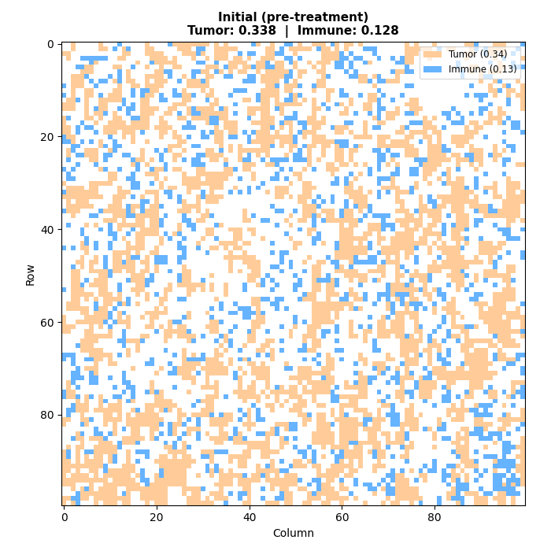

<h1 align="center">
  <a href="https://github.com/AgentTorch/TumorEnv" target="_blank">
    Calibrating Immunological Agents
  </a>
</h1>

<p align="center">
  <strong>differentiable tumor–immune simulations</strong><br>
  calibrated directly from biopsy images
</p>

<!-- <p align="center">
  <a href="https://agenttorch.github.io/AgentTorch/" target="_blank">
    
  </a>
  <a href="https://github.com/AgentTorch/TumorEnv" target="_blank">
    
  </a>
  <a href="https://deepliif.org/" target="_blank">
    
  </a>
</p> -->

## Overview

TumorEnv is an open-source framework for differentiable simulation and calibration of tumor–immune interactions from histopathology images. It combines biologically grounded agent-based dynamics with gradient-based optimization, enabling model parameters to be learned directly from biopsy observations. Built on top of the [AgentTorch](https://agenttorch.github.io/AgentTorch/) simulation framework, TumorEnv introduces oncology-specific cell dynamics, image-to-simulation preprocessing, differentiable calibration objectives, and visualization tools for studying tumor evolution and immune response.

Cancer progression and immune response emerge from millions of individual cellular decisions — proliferation, migration, combat, and death — unfolding across spatial tissue architectures. While traditional ABMs capture these dynamics, they lack differentiability, making calibration a black-box optimization problem. TumorEnv bridges this gap by making the entire simulation pipeline differentiable, allowing gradient-based calibration of model parameters directly from histopathology images.

## Highlights

- End-to-end pipeline from biopsy images to calibrated simulations
- Differentiable optimization through stochastic agent-based dynamics
- Gradient-based estimation of tumor–immune interaction parameters
- Spatial evaluation using the Spatial Agreement Measure (SAM)
- Modular framework for computational oncology research

## Simulation Overview

<p align="center">
  
</p>

Each simulation step executes eight biologically motivated substeps, allowing tumor and immune populations to proliferate, migrate, interact, and evolve over time.

## Pipeline

The TumorEnv pipeline transforms histopathology images into calibrated simulations through a multi-stage process:

<!-- <p align="center">
  <!-- <strong>Biopsy ImagesDeepliIF → Location Matrices → Agent-Based Model → Calibrated Dynamics</strong> -->
  <!-- <strong>Histopathology Images  → DeepliIF Cell Detection → Spatial Cell Maps → TumorEnv Simulation → Differentiable Calibration → Predicted Tumor Evolution</strong> 
  <strong>
    Histopathology Images
          ↓
 DeepliIF Cell Detection
          ↓
   Spatial Cell Maps
          ↓
  TumorEnv Simulation
          ↓
Differentiable Calibration
          ↓
Predicted Tumor Evolution
  </strong>
</p> -->
<p align="center">
  <strong>
    Histopathology Images <br>
    ↓ <br>
    DeepliIF Cell Detection <br>
    ↓ <br>
    Spatial Cell Maps <br>
    ↓ <br>
    TumorEnv Simulation <br>
    ↓ <br>
    Differentiable Calibration <br>
    ↓ <br>
    Predicted Tumor Evolution
  </strong>
</p>

### Image Preprocessing

Histopathology images are processed through the [DeepliIF model](https://deepliif.org/) to extract spatial location matrices for tumor cells and CD8+ T cells. These matrices encode the precise spatial distribution of each cell type across the tissue grid.

### Simulation Substeps

The agent-based model executes a sequence of biologically-motivated substeps in each simulation step:

| # | Substep | Description |
|---|---------|-------------|
| 1 | **Tumor Cell Proliferation** | Tumor cells divide with probability `TUpprol`, subject to proliferation capacity `TUprolmax` and symmetric division probability `TUps` |
| 2 | **Tumor Cell Migration** | Tumor cells migrate to neighboring grid positions with probability `TUpmig`, guided by the immunological map |
| 3 | **Immune Cell Proliferation** | CD8+ T cells proliferate with probability `IMpprol`, limited by proliferation capacity `IMprolmax` |
| 4 | **Immune Cell Migration** | Immune cells migrate toward tumor regions with probability `IMpmig`, influenced by random walk (`IMrwalk`) and speed (`IMspeed`) |
| 5 | **Tumor-Immune Cell Interaction (Combat)** | Immune cells engage and kill tumor cells with probability `IMpkill`, limited by killing capacity `IMkmax` and interaction capacity `IMintmax` |
| 6 | **Tumor Cell Death** | Tumor cells undergo natural death with probability `TUpdeath` |
| 7 | **Immune Cell Death** | Immune cells undergo natural death with probability `IMpdeath` |
| 8 | **Immune Cell Influx** | New immune cells enter the tumor microenvironment with probability `IMinfluxProb` at rate `IMinflRate` |

### Calibration

To estimate biologically meaningful parameters from tissue observations, TumorEnv provides two calibration approaches:

- **Gradient-Based Calibration**: Uses differentiable soft population accumulators (`soft_tumor_delta`, `soft_immune_delta`) to backpropagate through the simulation and optimize 7 of 9 parameters via gradient descent.
- **CMA-ES Calibration**: Black-box evolutionary optimization for all parameters, serving as a baseline comparison.

Both methods evaluate against post-treatment ground truth data using a composite loss function combining:
- **Fraction Loss**: MSE of tumor and immune cell population fractions
- **RDF Loss**: Radial distribution function discrepancy (spatial structure)
- **Clustering Loss**: Local clustering coefficient differences

## Key Features

- **Differentiability**: The entire simulation pipeline is differentiable through stochastic dynamics and conditional interventions, enabling gradient-based optimization of model parameters directly from biopsy data.
- **Clinical Calibration**: Model parameters are calibrated against real histopathology images using the Spatial Agreement Measure (SAM), minimizing the number of biopsy samples required for accurate predictions.
- **Multi-Modal Pipeline**: Biopsy images are converted to spatial cell location matrices via the DeepliIF model, which are then fed into the ABM as initial conditions — creating an end-to-end pipeline from tissue images to simulated dynamics.
- **Spatial Fidelity**: The model operates on a 2D spatial grid (100×100), capturing the spatial organization of tumor and immune cells through proliferation, migration, and interaction dynamics with local neighborhood constraints.

## Installation

### Prerequisites

TumorEnv requires Python ≥3.9 and PyTorch ≥2.0.0. If you have not installed Python 3.9, please do so first from [python.org/downloads](https://www.python.org/downloads/). TumorEnv depends on AgentTorch for its differentiable simulation engine.

### Setup

Clone the repository and install dependencies:

```sh
git clone -b substeps https://github.com/AgentTorch/TumorEnv.git
cd TumorEnv
python3 -m venv agent-torch-env
source agent-torch-env/bin/activate
pip install -r requirements.txt
pip install agent-torch==0.2.4
```

> **Note**: After installing `agent-torch`, you need to copy two helper files into the site-packages directory:
> ```sh
> cp AgentTorch/helpers/general.py <venv>/lib/python3.x/site-packages/AgentTorch/helpers/general.py
> cp AgentTorch/controller.py <venv>/lib/python3.x/site-packages/AgentTorch/controller.py
> ```

### Running a Simulation

Execute a simulation with the default configuration:

```sh
cd AgentTorch/models/tumorenv
python trainer.py -c config.yaml
```

### Gradient-Based Calibration

To run gradient-based parameter calibration:

```sh
python gradient_trainer.py
```

### Visualization

Generate trajectory visualizations including animations, RDF evolution, and comparison figures:

```sh
python visualize_trajectory.py --config config.yaml --output_dir visualizations
```

## Getting Started

### Running Your First Simulation

```py
from simulator import TU_IM_Runner, TUIM_registry
from AgentTorch.helpers import read_config

# Load configuration and registry
config = read_config("config.yaml")
registry = TUIM_registry()

# Initialize the runner
runner = TU_IM_Runner(config, registry)
runner.init()

# Run the simulation
num_steps = runner.config["simulation_metadata"]["num_steps_per_episode"]
runner.step(num_steps)

# Get initial and final states
initial_grid = runner.get_initial_state()
final_grid = runner.get_final_state()
```

### Calibrating Parameters with Gradients

```py
from gradient_trainer import main

# Run gradient-based calibration
calibrated_params, loss_breakdown, loss_history = main()
```

## Model Parameters

| Parameter | Description | Default | Calibratable |
|-----------|-------------|---------|:------------:|
| `TUpprol` | Tumor proliferation probability | 0.5055 | ✓ |
| `TUpmig` | Tumor migration probability | 0.35 | ✓ |
| `TUpdeath` | Tumor death probability | 0.12 | ✓ |
| `TUps` | Symmetric division probability | 0.7 | ✗ |
| `TUprolmax` | Tumor proliferation capacity | 10 | ✗ |
| `TUintmax` | Tumor interaction capacity | 2 | ✗ |
| `IMpprol` | Immune proliferation probability | 0.049 | ✓ |
| `IMpmig` | Immune migration probability | 0.8 | ✓ |
| `IMpdeath` | Immune death probability | 0.0147 | ✓ |
| `IMpkill` | Immune killing probability | 0.3 | ✗ |
| `IMprolmax` | Immune proliferation capacity | 10 | ✗ |
| `IMintmax` | Immune interaction capacity | 40 | ✗ |
| `IMkmax` | Immune killing capacity | 5 | ✗ |
| `IMrwalk` | Random walk influence | 0.8 | ✗ |
| `IMspeed` | Immune cell speed | 97 | ✗ |
| `IMinfluxProb` | Immune influx probability | 0.2 | ✓ |
| `IMinflRate` | Immune influx rate | 1 | ✗ |
| `engagementDuration` | Combat engagement duration | 48 | ✗ |

## License

Copyright (c) 2026 Pushkar Ambastha & Contributors

This project is licensed under the GNU Affero General Public License v3.0 (AGPL-3.0). This means:
- You can freely use, modify, and distribute this software
- If you use this software to provide services over a network, you must make your source code available to users
- Any modifications or derivative works must also be licensed under AGPL-3.0
- You must give appropriate credit and indicate any changes made
- For full terms, see [LICENSE.md](LICENSE.md) file in this repository

For inquiries about using this software in a proprietary product, please reach out to request a commercial license.

## Guides and Tutorials

### Understanding the Framework

A detailed explanation of the AgentTorch framework architecture can be found in the [AgentTorch documentation](https://agenttorch.github.io/AgentTorch/).

### Creating a Model

Tutorials on building agent-based models with AgentTorch are available in the [AgentTorch tutorials](https://agenttorch.github.io/AgentTorch/tutorials/config_api/).

### Contributing to TumorEnv

Thank you for your interest in contributing! You can contribute by:

- **Reporting bugs**: Open an issue describing the bug, reproduction steps, and expected behavior
- **Fixing bugs**: Submit a pull request with a clear description of the fix
- **Adding features**: Propose new substeps, calibration methods, or visualization tools
- **Improving documentation**: Help make the project more accessible to new users
- **Adding models**: Extend the framework to new cancer types or immune cell populations

<!-- Take a look at the [contributing guide](docs/contributing.md) for instructions on how to set up your environment, make changes to the codebase, and contribute them back to the project. -->

## Citation

If you use TumorEnv in your research, please cite:

```bibtex
@software{tumorenv,
  author = {Ambastha, Pushkar},
  title = {TumorEnv: Differentiable Agent-Based Modeling of Tumor-Immune Dynamics},
  year = {2026},
  url = {https://github.com/AgentTorch/TumorEnv}
}
```

## Acknowledgments

- TumorEnv is built on top of AgentTorch, an open-source framework for differentiable large-scale agent-based simulations. We thank the [AgentTorch](https://agenttorch.github.io/AgentTorch/) developers for making the underlying simulation infrastructure publicly available.
- Cell detection and spatial mapping are powered by [DeepliIF](https://deepliif.org/)
